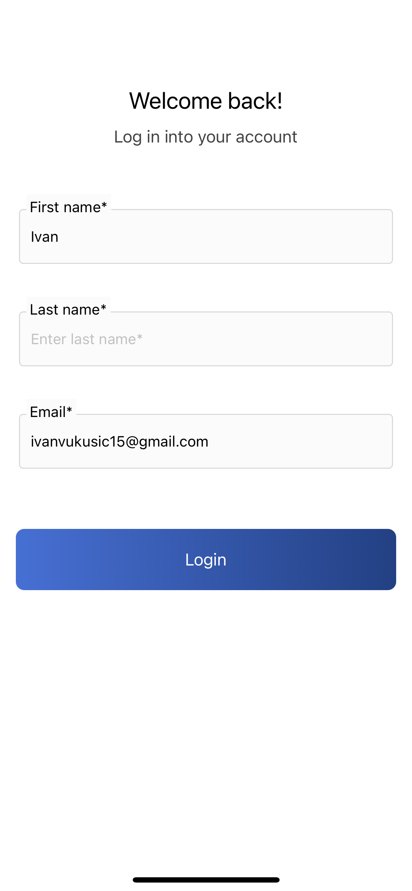
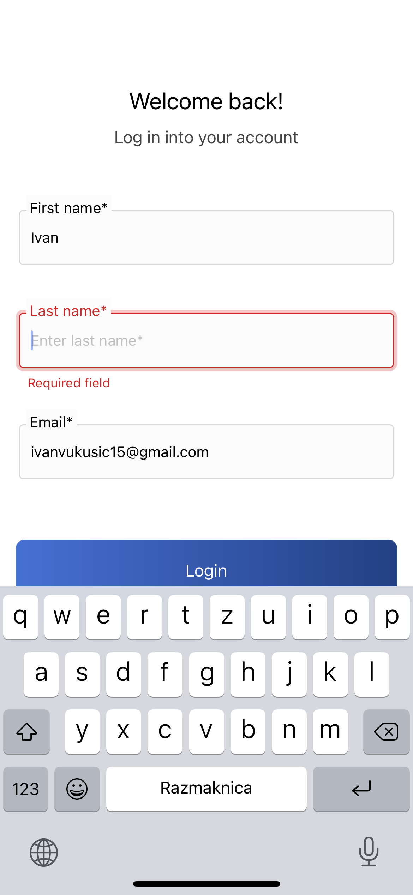
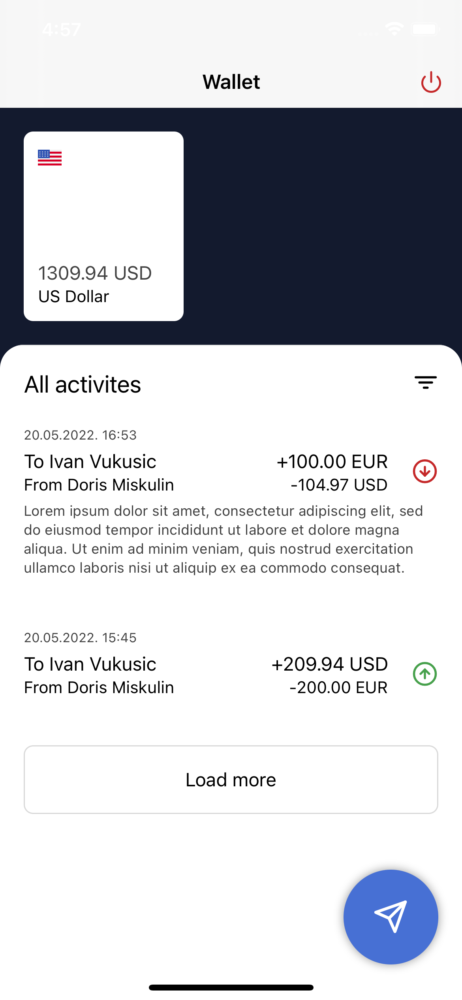
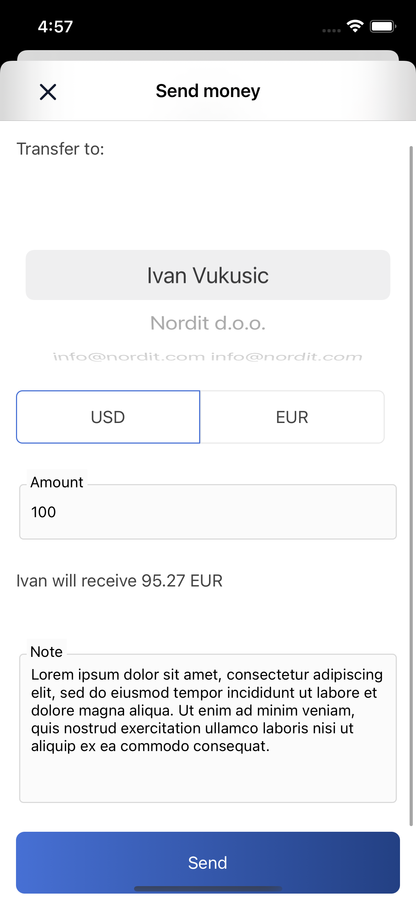

# WALLET mobile application

## Design and implemetation

<table>
  <tr>
    <td valign="top"></td>
    <td valign="top"></td>
    <td valign="top"></td>
    <td valign="top"></td>
  </tr>
</table>

## Coding rulebook

[RULEBOOK](RULEBOOK.md) - basic rules and branching strategy for application

## Included

- [Expo](https://expo.dev/)
- [React](https://github.com/facebook/react)
- [React Native](https://github.com/facebook/react-native)
- [Typescript](https://github.com/microsoft/TypeScript)
- [React Navigation](https://github.com/react-community/react-navigation)

---

## Prerequisites

Make sure to have the following installed:

- Xcode (download from apple store)
- [Android Studio](https://developer.android.com/studio)

You can use brew install for the following:

```bash
brew install yarn
brew install node
brew install watchman
```

---

## Installation

See
[Getting Started](https://facebook.github.io/react-native/docs/getting-started.html)
to install requirement tools.

```bash
$ yarn install
```

The project uses an `.env` file to save some local data. Create`.env` file in the project's root directory. It should like like `.env.example`

This file is not uploaded to Github, but you can download it from Dropbox: Please ask the other developers for the data in the `.env` file.

---

## Development

#### iOS

Run command to open iOS simulator and run app:

```bash
yarn ios
```

#### Android

Open Android emulator (recommended [Genymotion](https://www.genymotion.com)) and run command: (Or connect real device via USB)

```bash
yarn android
```
